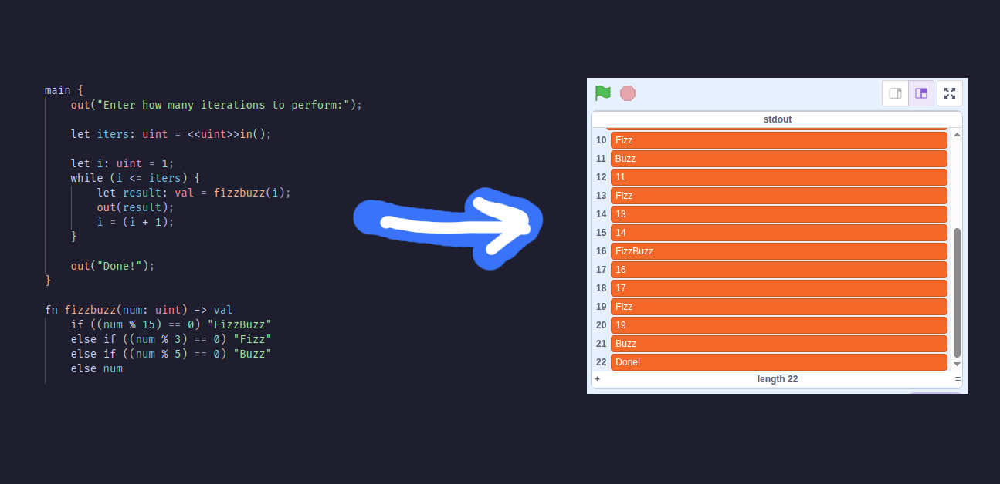

<p align="center">
  
</p>

<h1 align="center">Steplo</h1>
<h3 align="center">A Scratch Textual Esolang with Pointers, Linking, & Optimizations</h3>

<br>

<p align="center">
  
</p>

<p align="center">
  Join the <strong><code>tetro.dev</code></strong> Discord server (and use the <code>#steplo</code> channel) to chat or get updates about Steplo:
  <br>
  👉 <a href="https://discord.tetro.dev/">https://discord.tetro.dev/</a>
  <br><br>
  <i>A dedicated Discord server for Steplo will be created if enough interest is found!</i>
</p>

---
## 🚀 Quickstart

Want to jump straight into using Steplo? Check out the Steplo book for a guide to installing the compiler and the language's syntax and features 👉 [https://steplo.tetro.dev/](https://steplo.tetro.dev/)

## 💡 What is Steplo?

Steplo is a text-based esolang designed specifically for **Scratch**, bringing advanced programming features like memory management and type systems to the Scratch environment.

Its goals include:

* Adding new syntax and control flows not already existing as Scratch blocks
* Using **stack-based memory** as the primary memory model
* Compiling into custom "bytecode", designed specifically to integrate with Scratch’s native primitive types and features (sprites, sounds, costumes, pen, etc.)



---

## 🚫 What Steplo is *not*:

* A 1:1 syntax of Scratch blocks as text
* An emulator for existing CPU architectures

---

## ✨ Features
*✅ = Implemented | 🚧 = Planned*

| Status | Feature |
| :---: | --- |
| ✅ | Stdout / Printing |
| ✅ | Stack Memory |
| ✅ | Memory Pointers / References |
| ✅ | In-Memory Arrays |
| ✅ | Functions |
| ✅ | Branching / Control Flow |
| ✅ | Recursion |
| ✅ | Optimizer |
| ✅ | Static Typing |
| ✅ | Typecasting & Transmutations |
| ✅ | Typechecker |
| ✅ | Native Scratch Functionality (e.g. RNG, user input) |
| ✅ | Helpful Compiler Errors |
| 🚧 | Structs |
| 🚧 | Enums |
| 🚧 | Discriminated/Tagged Unions |
| 🚧 | Module System |
| 🚧 | External Linking / Libraries |
| 🚧 | More Scratch Native Features (e.g., sprites, key events, sounds, pen) |
| 🚧 | Language Server |
| 🚧 | Standard Formatter |
| 🚧 | VS Code (and possibly other IDEs) Extension |
| 🚧 | Standard Library |
| 🚧 | Built-in Heap Memory Support |
| 🚧 | Smart Pointers |

---

## ⚠️ Stability Notice

Steplo is still in **early development**, and it's currently **not** stable: Features, syntax, and internals are subject to breaking changes at any time.

The upside to this is that core functionality is still up for design changes. Your feedback is welcome and encouraged to help shape the future of the language!

---

## 🚀 Getting Started

### 🛠 Requirements

* [Rust](https://www.rust-lang.org/tools/install)

### 📦 Installation

```bash
# Clone the repo
git clone https://github.com/tetrogem/steplo.git
cd steplo

# (Optional) Create an output folder, or use an already existing folder
# Note: The local output folder named `out` is .gitignored, so it's safe to create/use!
mkdir out

# Compile a Steplo program
cargo run examples/hel.lo out
```

This will generate a `.sb3` file in the `out/` directory.

You can now open the `.sb3` in the Scratch editor and run your Steplo-compiled project!

---

### 🧪 Help & Commands

Run the following to see all CLI options:

```bash
cargo run -- -h
```

See additional documentation on all of Steplo's language features in the Steplo book 👉 [https://steplo.tetro.dev/](https://steplo.tetro.dev/)
